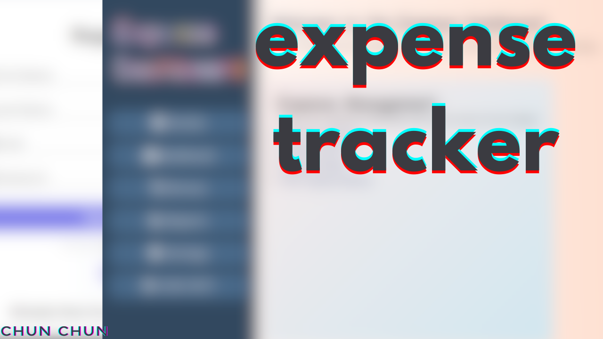

# Expense Tracker



A simple PHP and MySQL-based personal finance manager that allows users to:

- Track their expenses.
- Record amounts given or taken from others.
- View history of all financial activities.
- Register and log in using email/password or Google login.
- Use a clean and responsive interface.

## Features

- User registration and login
- OTP-based email verification (optional enhancement)
- Google login (OAuth 2.0)
- Record "given" and "taken" amounts
- Store and view transaction history
- Organized structure using PHP, MySQL, HTML/CSS, and JavaScript

## Getting Started

### Prerequisites

- XAMPP/WAMP/LAMP installed and running
- PHP ≥ 7.x
- MySQL
- Composer (optional if using any packages)

### Setup

1. **Clone the Repository**
   `git clone https://github.com/yourusername/expense-tracker.git`

2. **Move the Project to XAMPP's htdocs Folder**

```bash
cp -r expense-tracker /path-to-xampp/htdocs/
```
